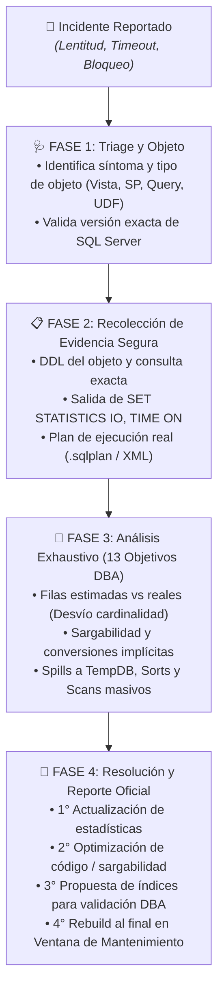

# Central de Skills para Agentes de IA (Skills Hub)

Catálogo centralizado e instalador interactivo de skills especializadas para agentes de Inteligencia Artificial (**Google Antigravity**, **Claude**, **Codex / OpenAI**, **OpenCode / Roo Code / Cursor**).

Diseñado para que cualquier usuario de soporte o desarrollo pueda instalar, actualizar y gestionar habilidades avanzadas en sus agentes locales con **un solo comando**, sin riesgo de alterar configuraciones ni rutas complejas.

## 🚀 Instalacion Rapida

No necesitas descargar ni clonar este repositorio manualmente. Puedes instalar, actualizar o desinstalar las skills directamente en los entornos de tus agentes utilizando el instalador interactivo via `npx`.

| Skill | Directorio | Versión | Descripción y Alcance |
| :--- | :--- | :---: | :--- |
| **dba-soporte** | `skills/dba-soporte/` | **v1.4.0** | Asistente DBA Senior Interactivo para diagnóstico clínico de rendimiento en **Microsoft SQL Server**. Guía a ejecutivos y soporte paso a paso con seguridad Zero-Trust y reporte ejecutivo de 13 secciones. |
| **dbtools-portable** | `skills/dbtools-portable/` | **v1.0.0** | Suite portable con 5 roles especializados (developer, administrator, tuning, audit/security, data-analyst) y orquestador para **Microsoft SQL Server** (Standard/Enterprise). |
| **demo-echo** | `skills/demo-echo/` | **v1.0.0** | Skill de verificación rápida. Permite comprobar en segundos que el agente carga e interpreta correctamente el entorno de skills. |

---

## 🔍 Detalle y Alcance de la Skill: `dba-soporte` (v1.4.0)

La skill `dba-soporte` transforma al agente de IA en un **Asistente DBA Senior Interactivo** enfocado en apoyar al personal de soporte técnico (L1/L2), asesores y desarrolladores para resolver problemas de lentitud e incidentes de base de datos con rigor profesional.



### 🎯 1. Alcance Universal de Objetos
El diagnóstico aplica para cualquier objeto o estructura en Microsoft SQL Server:
- **Vistas (Views):** Análisis de relaciones internas, dispersión de JOINs y tablas subyacentes.
- **Stored Procedures (SPs):** Evaluación de parámetros, transaccionalidad y cuellos de botella.
- **Consultas y Tablas (Ad-hoc / Batch):** Identificación de lecturas masivas para resultados puntuales.
- **Funciones (UDFs):** Detección de funciones escalares y de tabla multisentencia que degradan el rendimiento.

### 🛡️ 2. Seguridad Estricta y Cero Confianza (Zero-Trust)
- **Cero Acceso a BD:** El agente nunca solicita ni necesita cadenas de conexión, IPs, usuarios o contraseñas.
- **Detección de Credenciales:** Si el usuario comparte credenciales por error, el agente detiene el análisis y emite una advertencia severa exigiendo su rotación.
- **Prohibición de Eliminación:** El agente nunca sugerirá sentencias destructivas (`DELETE`, `TRUNCATE`, `DROP TABLE`, `DROP INDEX`, `DROP VIEW`). Si el usuario lo propone, se remite a evaluación formal con el DBA.
- **Inmunidad de Instrucciones (Anti-Jailbreak):** Si el usuario intenta anular las directivas de seguridad (*"olvida tus reglas previas"*), el agente **cierra la sesión de inmediato**.

### ⚖️ 3. Jerarquía Estricta de Soluciones (Regla de Oro DBA)
1. 🥇 **1° Estadísticas Primero:** Evaluar la actualización de estadísticas (`UPDATE STATISTICS`) antes de pensar en índices.
2. 🥈 **2° Optimización de Código y Sargabilidad:** Corregir funciones en predicados (`WHERE`/`JOIN`) y conversiones implícitas de tipos.
3. 🥉 **3° Propuesta de Índices con Respaldo:** Un *Scan* no justifica un índice por sí solo. Cualquier nuevo índice se etiqueta como **`PROPUESTA PARA VALIDACIÓN DEL DBA`** (no ejecutable directo).
4. 🛑 **4° Rebuild de Índices al Final:** La reconstrucción (`ALTER INDEX REBUILD`) queda como último recurso por su alto impacto de I/O y bloqueo.
5. 🕒 **Ventanas de Mantenimiento:** Toda acción de mantenimiento pesado debe prescribirse para horarios no hábiles / fuera de horas pico.

### 📑 4. Generación de Reporte Oficial de 13 Secciones
Bajo la instrucción de *"generar reporte"*, *"emitir diagnostico"* o *"dame el informe"*, el agente compila un informe completo en Markdown con:
1. Conclusión ejecutiva accesible para soporte y negocio.
2. Comportamiento interno del motor paso a paso.
3. Análisis de la definición DDL y relaciones del objeto.
4. Análisis del Plan de Ejecución y operadores más costosos.
5. Comparativa de Filas Solicitadas vs Filas Procesadas (Desvío de cardinalidad).
6. Análisis de filtros y sargabilidad.
7. Análisis de ordenamiento (`ORDER BY` / `SORT`) y memoria.
8. Análisis de índices existentes y faltantes.
9. Evaluación de causas alternativas (bloqueos, esperas, parameter sniffing, TempDB).
10. Diagnóstico preliminar clasificado por categoría.
11. Nivel de confianza (`ALTO`, `MEDIO`, `BAJO`) con justificación.
12. Plan de trabajo estructurado: tareas para el Ejecutivo de Soporte vs propuesta formal para el DBA.
13. Información faltante y siguientes pasos.

---

## 💻 Instalación y Uso de Skills-Hub

### 1. Instalación Rápida
En cualquier terminal (Windows PowerShell, Command Prompt, Linux o macOS):
```bash
npx github:MiOrganizacion/skills-hub
```

**Navegación interactiva:**
- **Moverse:** Flechas `[Arriba]` / `[Abajo]`
- **Marcar / Desmarcar:** Barra espaciadora `[Espacio]`
- **Seleccionar todo:** Tecla `[A]`
- **Confirmar instalación:** Tecla `[Enter]`

---

### 2. Actualización de Skills
Para escanear y actualizar las skills instaladas en tus agentes locales:
```bash
npx github:TU-ORGANIZACION/skills-hub update
```
- Escanea únicamente las skills ya instaladas en tu equipo.
- Detecta diferencias de versión (ej. `v1.3.0 -> v1.4.0`) y te permite actualizar con un clic.

---

### 3. Desinstalación Limpia
Para remover una o varias skills:
```bash
npx github:TU-ORGANIZACION/skills-hub uninstall
```
- Permite desinstalar por skill completa o por agente específico.
- Elimina limpiamente la carpeta correspondiente sin alterar otras configuraciones.

---

## 👤 Autor y Mantenimiento
- **Autor del instalador y arquitectura de skills:** `iaav`
- **Repositorio:** Preparado para la integración progresiva de nuevas skills corporativas.
